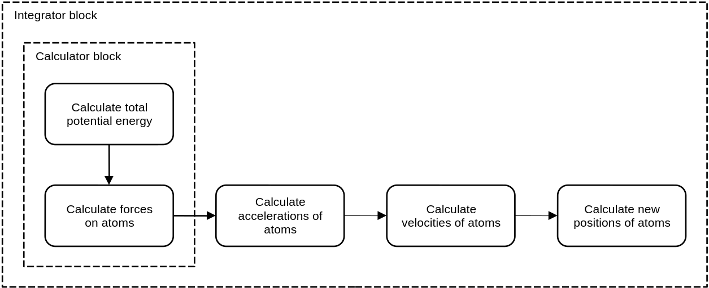
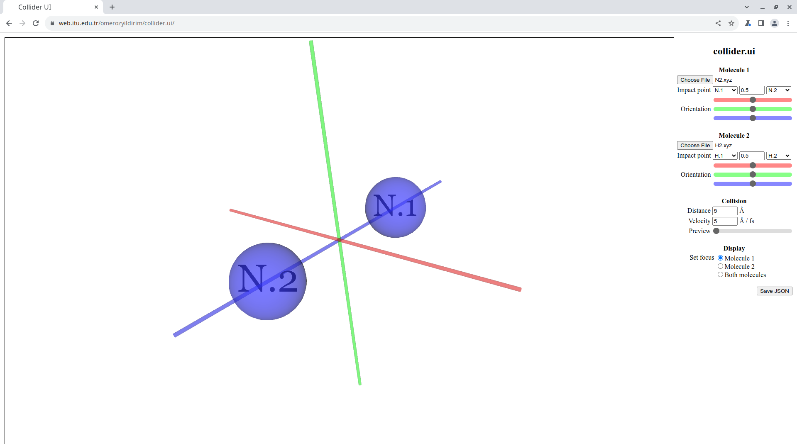
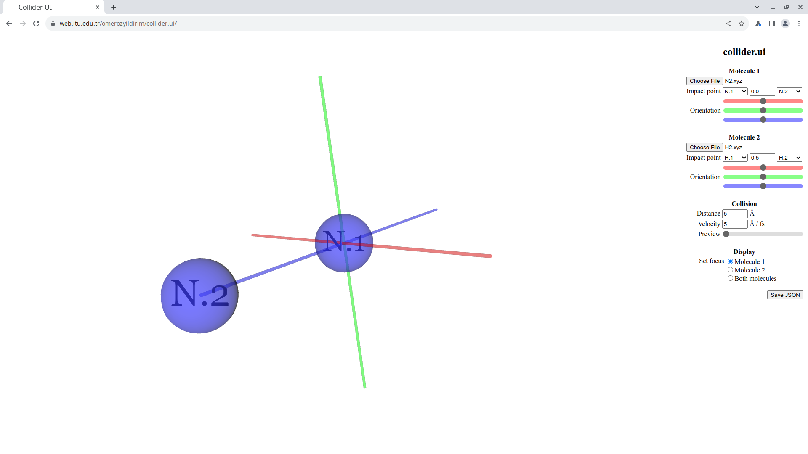
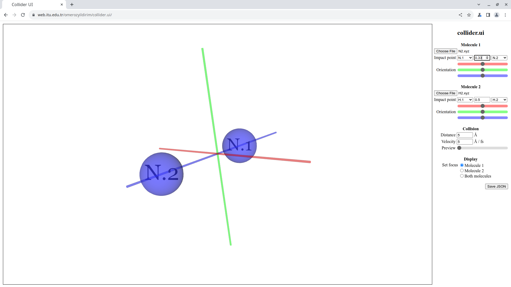
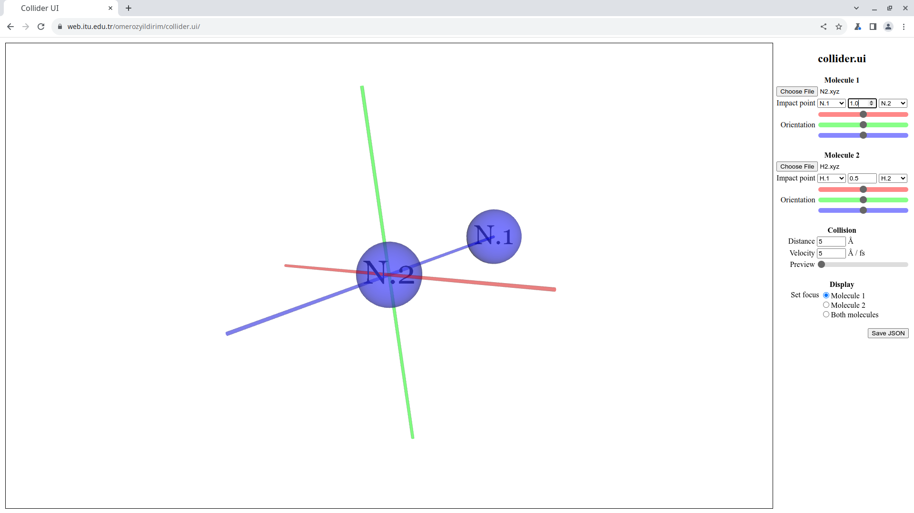
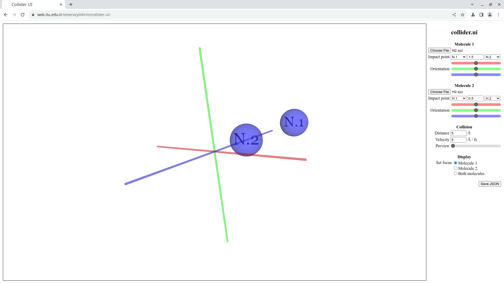
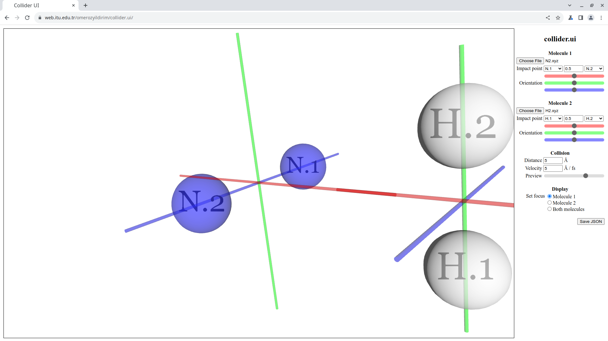
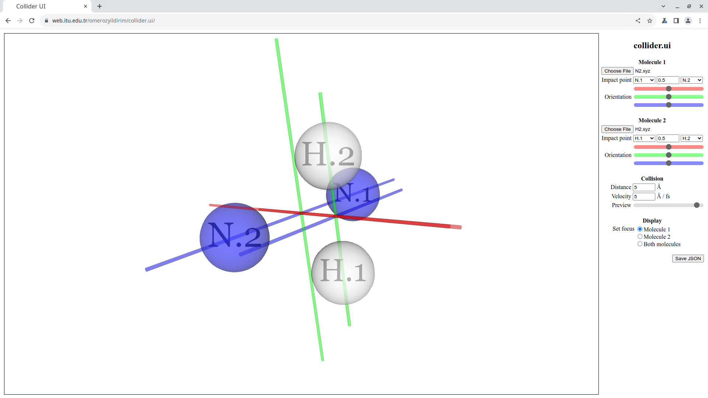
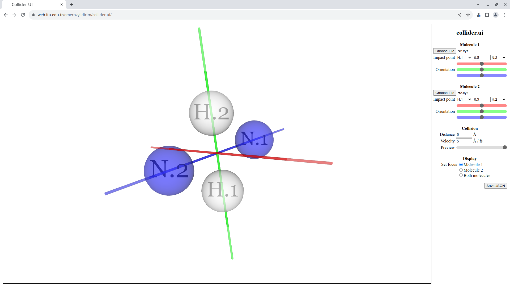

# Introduction

The current reaction product estimation paradigm is based on prior experimental results. Conventional methods, i.e., a detailed database query or a machine learning algorithm, require experimental reaction data already recorded.<sup>1–5</sup> As a result, any new reactions which do not resemble the experimental records are not likely to be estimated. The solution is to *'calculate'* the output of a reaction using computational chemistry methods.

Computational chemistry is an umbrella term for a wide range of calculations which, in modern times, are only possible with their software implementations. Those software packages are mostly used in a black-box approach. Potential users have only basic knowledge of the methodology the software is based on, let alone any implementation details. The basic problem solved by computational chemistry is the optimized structure of a molecule in 3-dimensional space. The classical approach is to use the ball and stick model of molecules to optimize the bond lengths and angles to obtain the minimum energy form of the same bond pattern. Quantum chemistry methods on the other hand are based on the solution of Schrödinger Equation for the electrons inside the molecule, also known as the electronic methods.<sup>6–8</sup>

From a reaction prediction point of view, the literature is full of examples which treat the optimization routines of quantum chemistry software like they are time integrators. They represent their results as if they are the final state of a process tracked in time domain. The researchers, providing the initial state of the system to such a software, try to calculate the outcome of the process at the end of a time interval, where in fact, those programs entirely ignore the temporal evolution of the system, making their calculations in a timeless universe which includes only a few tens of atoms and nothing else.

Overcoming this misuse is possible by using simulation software like a molecular dynamics (MD) package. MD is based on a stochastic methodology - it depends on randomized initial conditions and movements and keeps the simulation within the boundaries of a predefined macroscopic pattern like NVT, NPT or adiabatic. The initial velocities and orientations of molecules are randomized prior to the start of the simulation so that the initial condition of the system represents a distribution similar to a natural state. The attributes of individual molecules are neither fine-tuned nor taken into account. The resulting molecular bulk is analyzed after the simulation is concluded to make sense of the results. Classical MD defines constant molecules and does not simulate chemical reactions - bond breaking or making cannot be simulated. This makes the results useless to estimate any possible chemical reactions.

Reaction prediction requires simulating changes in bonding patterns, for which ab initio MD methods should be used. Using this methodology results in drastic increases in computation resource requirements - both computation time and memory. To have a statistically significant amount of collision diversity, hundreds, perhaps thousands, of molecules need to be simulated. Only then, it can be assumed that there have been enough number of energetically significant collisions that resulted in a reaction. The resulting new molecules should be explored from the results of multitudes of collisions that happened during the simulation, long after the simulation has finished. This analysis requires considerable computational sources in addition to the ones required for running the simulation required to obtain those collisions.

The approach forming the basis of the framework presented in this study is quite the opposite, designing collision conditions in detail before the collision occurs. Collision theory states that for the two molecules to react, they have to hit each other with the correct orientation, exchanging enough amount of kinetic energy. <sup>9–11</sup> The results of such simulated collisions provide an insight into possible products - either final or intermediate - of the reactions they represent. Producing those results does not need any initial information about the reaction, nor the extensive computational requirements of the ab initio MD simulations. Those results may be used as intermediate inputs for further collisions if needed, so that the results of the sequential collisions may converge to the overall product of a reaction.

ASE is a Python library that provides the capability to define chemical species and run their simulations. It has a modular architecture so that the "calculators" and "integrators" can be defined separately, or even be coded from scratch for occasional requirements. "Calculators" calculate the energy of the system, while "integrators" iterate the evolution of the system in either time or another arbitrary coordinate system.<sup>12</sup> They are used either to calculate a more optimized spatial distribution of the system by changing the distribution in a way to minimize the total potential energy, or to calculate the trajectories of individual atoms in time domain using the calculated forces on each atom.

# Theoretical Methodology

## Defining the collision

To clearly define a collision between two molecules, the collision energy (via linear velocity), the points inside each molecule which actually contact, and the contact orientation of each molecule should be determined. As a result, a collision is in fact a set of parameters including:

- Two molecules to collide
- Initial distance between the molecules
- Their relative linear velocities
- One point inside each molecule that will actually contact
- Their relative orientations around contact points

The molecules can be defined in one of the many ways ASE allows: they can be imported from one of the databases ASE includes, they can be expressed atom by atom defining the elements and positions for each atom or, perhaps most conveniently, they can be imported from molecule definition files. Since ASE can import virtually any molecule definition file format, there will be no restrictions on that matter. Initial distance is just a scalar value. Relative velocity, although velocity is a vector, is a scalar value as well, which is the magnitude of the actual velocity vector. The direction of the vector is from the collision point of the second molecule to the collision point of the first molecule.

## Points inside the molecule

A point inside a molecule can be defined in many ways. The most obvious method is expressing the absolute coordinates in 3-dimensional space. In that case, it would be difficult for the user to define a point that overlaps with a specific atom or lies along a bond. In addition to that, as the orientation of the molecule changes, the definition of the point should be recalculated and redefined. Most importantly, it would be unintuitive for the users to comprehend. In this work, a more chemically significant definition is designed which is directly connected to the atoms inside the molecule. As a result, the changes in the orientation of the molecule do not affect the definition of the point as it moves along with the atoms it is based on.

A point inside a molecule is defined on the imaginary line segment connecting two selected atoms. So, the point information consists of two atom indices along with a ratio defining the distance of the point from the first atom on the line segment connecting the atoms. If the ratio is 0, the point is on top of the first atom, if it is 1 the point is right on top of the second atom. To place the point at equal distance from both atoms, the ratio should be 0.5. It is possible to define a point outside the line segment by giving the ratio a value below 0 (in which case the point will be on the first atom's side) or above 1 (it will be on the second atom's side).

## Orientations of molecules

The relative orientations of the molecules are represented by a transformation matrix in 3 spatial dimensions for each molecule. Such a matrix would include the position as well as the orientation information about the molecule. In 3-dimensional space, any change in the position or the orientation of the objects with respect to the origin are called linear transformations. Linear algebra formulates these operations using transformation matrices. A transformation matrix *A*, when multiplied by a vector **x**, which represents a point in 3-dimensional space, results in applying the transformation to the vector, effectively changing its position or orientation with respect to the origin.<sup>13,14</sup>

						(1)

Rotation can be represented by the following matrices:

					(2a)

					(2b)

					(2c)

$R_x$, $R_y$ and $R_z$ indicate the rotations around *x*, *y* and *z* axis, with the angles $\alpha$, $\beta$, and $\gamma$ respectively. These three rotations can be combined by multiplying the rotation matrices.

					(3)

This operation results in the following combined rotation matrix:

		(4)

Translation is defined by a vector and implemented simply by a vector addition operation. To calculate both translation and rotation as a single matrix multiplication, the matrices of both operations must be expressed in homogeneous coordinates:

						(5)


Following the multiplication of the rotation matrix and the transformation matrix, the combined transformation matrix can be defined as follows:

	(6)

Applying the transformation to the molecules is implemented by multiplying each and every atomic coordinate by the transformation matrix defined in Equation (6).

# Performing the collision

Temporal evolution of molecular systems can be simulated using Molecular Dynamics (MD). Its theoretical background is based on Newton's law of motion. The total potential energy of the system and forces acting on the atoms as a result of the potential energy field are calculated. Then using the forces accelerations, using the accelerations velocities and using the velocities new positions of the atoms are calculated. Once the new positions are determined, the forces for the new configuration are calculated and the loop continues for a certain number of iterations. The key components of the methodology here are the algorithm for calculating the forces and the iteration algorithm for temporal integration - as implemented separately in ASE (Figure 1).



**Figure 1.** Simulation structure of ASE

The methodology for calculating the energy and the forces on the atoms determine the capabilities of the simulation. Classical calculators treat the molecules as unbreakable entities - bonding structure is kept unchanged. As a result, bond breaking and forming (chemical reactions) cannot be simulated and the computational resource requirements are low. *Ab initio* calculators which are based on electronic structure methods (Quantum Chemistry and Density Functional Theory) treat atoms individually and allow the exchange of atoms among molecules at the cost of more computational resources.<sup>6</sup>

Software implementation of the time integrator may vary for the system being isothermal, isobaric or adiabatic.<sup>6</sup> The usage of already existing integrators of ASE would be sufficient for the purpose of this work.

The difference of this work's methodology lies in the number of molecules the system contains. Each collision needs only two molecules, forming a minimalist simulation, which is enough to calculate the output resulting from that single collision.

# Installation

Since it is a pure Python library, molecol.py should be put in the same directory with your custom scripts, without the need for any other installation instructions. molecol.ui is a web application and no installation is needed, only browse the URL with your favorite browser.

# Usage details

This section explains how the molecol.py library can be used in your scripts, with the details of the example script given. The whole framework can be downloaded from github.org.<sup>15</sup> The script accepts 3 command-line arguments; the JSON file containing the collision parameters (the output of molecol.ui), number of steps in a simulation block and the number of blocks for the simulation to continue. The simulation is divided into blocks so that at the end of each block the electron density information is written as a cube file. The user can adjust the frequency of the generated cube files by adjusting the number of blocks and the number of steps inside a block.

```python
import sys
from ase import units
import json
with open(sys.argv[1]) as json_file:
input_data = json.load(json_file)
input1 = input_data["inputs"][0]
input2 = input_data["inputs"][1]
distance = input_data["distance"] # It's already in Angstroms
velocity = input_data["velocity"] * units.Ang / units.fs
steps = int(sys.argv[2])
blocks = int(sys.argv[3])
filename = sys.argv[1].replace(".json", "")
```

Once the collision parameters are imported and the command-line parameters are parsed, a collision object is initialized.

```python
from gpaw import GPAW
calculator = GPAW(txt = filename + '_calc.log')
from ase.md.verlet import VelocityVerlet
integrator = VelocityVerlet
timestep = 0.1 / velocity
coll1 = Collision(input1, input2, calculator, integrator, filename)
result = coll1.collide(distance, velocity, timestep, steps, blocks)
```

GPAW is a DFT package for ASE library.<sup>16,17</sup> Since it is based on DFT, bond breaking and forming processes can be simulated. Here it is used with the default parameters, only a filename is defined so that the DFT calculations can be logged. For different input molecules, the parameters may need to be fine-tuned to achieve convergence during energy calculations. Velocity-Verlet is the most basic MD integrator, perfectly suitable to simulate a couple of molecules.

During initialization, Collision object needs 2 input molecules which are imported from the JSON file, the calculator and integrator objects and the filename for the logging processes. Calling the collide method of the new Collision object will perform the collision and a boolean value will be returned at the end indicating the success or the failure of the simulation process (a failure indicates an error during the calculations, which is mostly a convergence error during the iterations). The collide method receives the distance of molecules, magnitude of their relative velocity (direction of the velocity is always from the collision point of the second molecule to the collision point of the first one), the timestep value and number of simulation steps in a single block and the number of blocks. At the end of each block, the total electron density of the system is saved to a file with a name containing the step and time values. The message attribute of the Collision object contains a string which includes a short summary of the collision result or the source of error in case of a failure.

The script outputs the following series of files during the simulation:

initial.xyz: The initial state of the molecules,

final.xyz: The state of the molecules after the simulation finishes,

x.traj: An ASE trajectory file of the simulation, where x is the JSON filename

x\_calc.log: Log file of the calculator, where x is the JSON filename

x\_intg.log: Log file of the integrator, where x is the JSON filename

x\_a\_b\_c.cube: A group of cube files (exactly command-line argument block + 1 files in case of a successful simulation) storing the total electron density of the system for each block where x is the JSON filename, a is the block number, b is the step number and c is the time in picoseconds.

Here, xyz files can be viewed using any molecule viewer, log files are plain text files and can be viewed using any text editor, traj files are ASE trajectories and can be visualized using ASE GUI and cube files can be visualized using a cube file viewer or further analyzed using appropriate software.

# UI details

A web application named molecol.ui is presented to make the adjustment of the parameters much easier using an intuitive user interface.<sup>18</sup> The main view presents a 3-dimensional representation of the molecules to collide so that the orientations can be adjusted visually using the controls on the right of the window. On the initial view, a pair of axes sets can be seen which represent the local origins of the molecules as seen in Figure 2. The collision points of the molecules are the origins of their local axes. The molecules are modified around these origins so that the collision point chosen lies on top of these local origins.


**Figure 2.** Initial main view of molecol.ui.


**Figure 3.** Main view of molecol.ui after the molecules are imported.

The molecules can be imported using the file import buttons labeled "Choose File". After a molecule is imported, its atoms are represented by CPK colored spheres,</sup> as seen in Figure 3. The atomic spheres share a small constant radius, which does not change proportional to atomic radii. This choice is made to avoid the larger atomic spheres obscuring the collision points. Labels seen inside the atomic spheres match the representation of each atom inside the selectors. They are composed of the element symbol and the sequence number of the atom in the molecule description file to provide a unique label for each atom. The orientations of imported molecules can be adjusted using the sliders, which are color-coded matching the colors of the local axes of the molecules - each slider rotates the molecule around the axis with the same color.



**Figure 4.** The focus of the main view is set to the first molecule.

The focus of the main view can be set to either or both of the molecules using the radio buttons on the display section (Figure 4). The distance between the molecules and the initial velocity of the second molecule can be set using the numeric input fields on the collision section.

|||
| :- | :- |
|||
||||

**Figure 5.** Positioning the molecule with respect to local origin as a result of different ratio values. Top row: -0.5, 0.0, middle row: 0.33, 0.5, bottom row: 1.0, 1.5

Impact points on each molecule can be adjusted by selecting the atoms and changing the ratio value on each molecule's sections. The first atom can be selected with the selector on the left, the second atom can be selected using the selector on the right. The ratio value can be entered into the numeric input field in the middle. The results of different ratio values can be seen in Figure 5. A value of 0.0 means the point is right on the first atom, 1.0 means the point is right on the second atom, 0.5 means right on the middle point between two atoms. Any value between 0.0 and 0.5 means the point is closer to the first atom, between 0.5 and 1.0 means the point is closer to the second atom. Negative values are possible, moving the point out from the first atom's side, as well as values greater than 1.0 which moves the point out from the second atom's side.

|||
| :- | :- |
||||

**Figure 6.** Previewing the collision - mid-bond of one molecule to the mid-bond of the other.

The collision can be previewed using the preview slider to see the collision instance more clearly, as seen on Figure 6. The slider moves the second molecule along the collision path, with the rightmost position representing the hypothetical collision instance. After the adjustments are finished, the JSON file can be obtained using the Save JSON button.

# Conclusion

Collision forms the basis of most of the intermolecular processes, which are interpreted as chemical reactions or all kinds of transport phenomena. This work introduces an easy-to-use framework based on popular, widely used technologies to simulate molecular collisions. The results provide an insight for the reaction products or intermediates, with a minimalist perspective, especially for gas phase or heterogeneous reactions.
